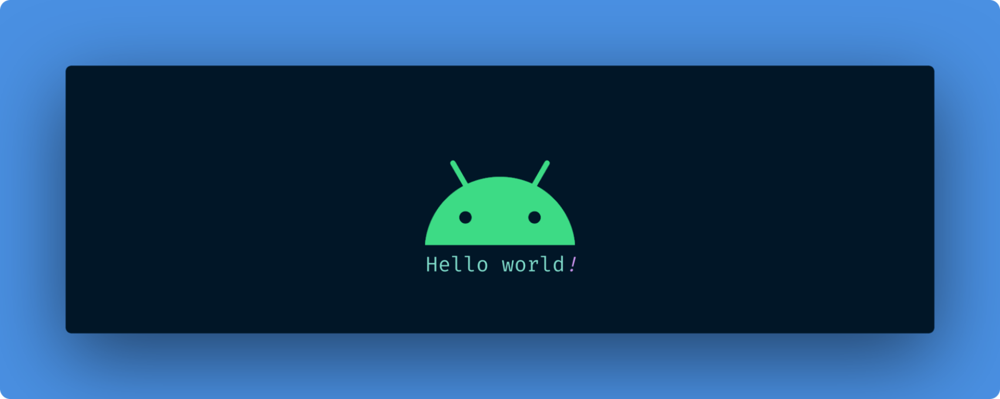
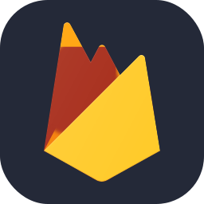
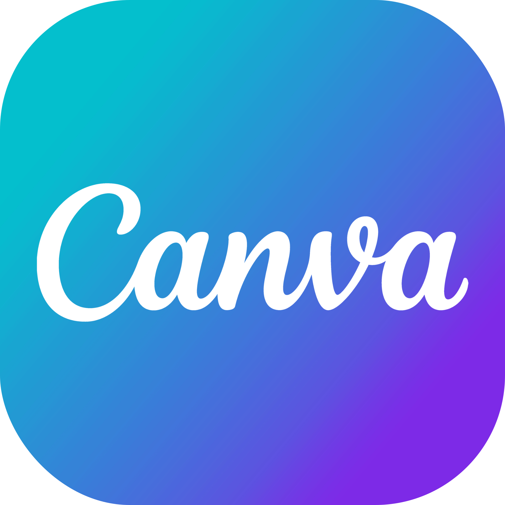

<h1 align="center">Hey There 👋 I'm Mustafa</h1>

<br/>

<div align=center>
  
</div>

<p align="center">
  <a href="mailto:info@mustafatoktas.com" target="_blank"></a>
  <a href="https://www.linkedin.com/in/mustafatoktas/" target="_blank"></a>
  <a href="https://www.mustafatoktas.com" target="_blank"></a>
  <a href="https://www.instagram.com/mustafatoktas00/" target="_blank"></a>
  <a href="https://steamcommunity.com/id/mtoktas/" target="_blank"></a>
  <a href="https://www.youtube.com/@mustafatoktas" target="_blank"></a>
</p>

---

## A Little Bit About Me and My Interests


```yaml
name: Mustafa TOKTAS
birth: 1999
located_in: Kocaeli, Turkey
current_job: Android & WEB Developer
company: Toktasoft
technical_background:
  [
    "Freelance Software Developer  @Toktasoft,            May 2020 - Present",
    "Software Developer            @Lavira Rocket,        Oct 2022 - Jan 2023",
    "Software Developer            @KOU ElectriCar,       Oct 2021 - Sep 2022",
    "Intern R&D Engineer           @Daiichi Electronics,  Jul - Aug 2021",
  ]
education:
  [
    "Management Information Systems  @Ankara University",
    "Electrical Engineering          @Kocaeli University",
  ]
fields_of_interests:
  [
    "Android Development",
    "Kotlin Multiplatform",
    "Web Development",
  ]

currently_learning:
  [
    "Jetpack Compose", 
    "Kobweb",
  ]
hobbies:
  [
    "Age of Empires 3 DE",
    "Book",
    "Music"
  ]
```
---
## My Github Repository Naming

- **A** &nbsp;&nbsp; -> Android Projects
  - **Just A** &nbsp;&nbsp; -> Functional Android Projects
  - **A.UI** &nbsp;&nbsp; -> Interface Work (non-functional)

- **W** &nbsp;&nbsp; -> WEB Projects 
  - **W.FS** &nbsp;&nbsp; -> Fullstack Web Projects
  - **W.BE** &nbsp;&nbsp; -> Back-end Web Projects
  - **W.FE** &nbsp;&nbsp; -> Front-end Web Projects
- **D** &nbsp;&nbsp; -> Desktop Projects
  - **Just D** &nbsp;&nbsp; -> Functional Desktop Projects
  - **D.UI** &nbsp;&nbsp; -> Interface Work (non-functional)
- **O** &nbsp;&nbsp; -> Other Projects (for ex. Arduino projects)


  
---
## Language & Framework
<p align="left">
<a href="https://kotlinlang.org" target="_blank">  </a>
<a href="https://developer.android.com/jetpack/compose" target="_blank">  </a>
<a href="https://kobweb.varabyte.com" target="_blank">  </a>
<a href="https://ktor.io" target="_blank">  </a>

<a href="https://dotnet.microsoft.com/en-us/languages/csharp" target="_blank">  </a>
</p>


## Database
<p align="left">
<a href="https://firebase.google.com" target="_blank">  </a>
<a href="https://www.mongodb.com" target="_blank">  </a>
<a href="https://www.sqlite.org/index.html" target="_blank">  </a>
</p>


## IDE
<p align="left">
  <a href="https://www.jetbrains.com/idea/" target="_blank">  </a>
  <a href="https://developer.android.com/studio/" target="_blank">  </a>  
  <a href="https://visualstudio.microsoft.com/tr/" target="_blank">   </a>  
  <a href="https://code.visualstudio.com" target="_blank">   </a>  
  <a href="https://www.arduino.cc" target="_blank">    </a>  
</p>


## Design
<p align="left">
 <a href="https://www.figma.com" target="_blank">    </a>

<a href="https://www.canva.com/en/" target="_blank">    </a>
</p>


## Tool and Other
<p align="left">
<a href="https://www.postman.com" target="_blank">    </a>
<a href="https://gradle.org" target="_blank">    </a>
<a href="https://git-scm.com" target="_blank">    </a>
<a href="https://github.com" target="_blank">    </a>
</p>

---

## System Features
<div>

 
<h4 align="left">CPU</h4>

<p align="left">
Intel® Core™ i7-10875H
</p>

<h4 align="left">GPU</h4>

<p align="left">
Nvidia® GeForce RTX 2070 Super
</p>

<h4 align="left">RAM</h4>

<p align="left">
 Corsair Vengeance 32 GB (2×16 GB) DDR4 3000 MHz
</p>

<h4 align="left">SSD</h4>

<p align="left">
  Samsung 970 Evo 1 TB m.2 SSD
<br/>
 Samsung PM981a 512 GB m.2 SSD
</p>

</div>


###### Last update of README.md file: 8 December 2023

<!-- "mustafatoktas/mustafatoktas" is a  _special_  repository because  this file (README.md) appears in my GitHub profile -->

